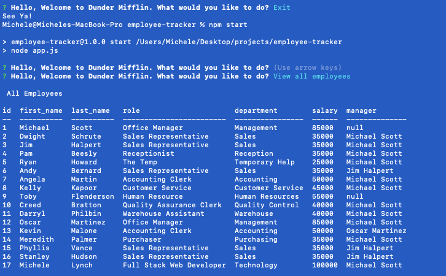

# Employee-Tracker

## Description   
A command-line application to manage a company's employee database, using Node.js, Inquirer, and MySQL.

***
### Table of Contents  
1. [Installation](https://github.com/MLLynch2K/employee-tracker#installation)
2. [Usage](https://github.com/MLLynch2K/employee-tracker#usage)
3. [Screenshot](https://github.com/MLLynch2K/employee-tracker#screenshot)
4. [Video Walkthrough](https://github.com/MLLynch2K/employee-tracker#video-walkthrough)
5. [Features](https://github.com/MLLynch2K/employee-tracker#features)
6. [Contributors](https://github.com/MLLynch2K/employee-tracker#contributors)
7. [Questions](https://github.com/MLLynch2K/employee-tracker#questions)  

***
### Installation 
Install NPM   
Install Inquirer   
Install MySQL2   
Install Console Table   
Run 'npm start' to enter the application

***
### Usage
The end-user will be led through prompts to help them to add, view, or modify the employee database.

***
### Screenshot  
  

***
### Video Walkthrough
[Video](https://drive.google.com/file/d/1g1p_oGOrFInFvxkg2qdWyjHfXVtkVwo9/view)

***
### Features  
JavaScript  
NPM  
MySQL2 - to connect MySQL database and perform queries      
Inquirer - to interact with the user via the command-line   
Console Table - to print MySQL rows to the console

***
### Contributors  
Michele Lee Lynch

***
### Questions  
Github: MLLynch2K  
Email: michele.lynch8@yahoo.com
